# ✅ RéussirSonCV – Créez votre CV facilement et rapidement

**Auteur :** Mohamed Maghzaoui  
**Titre :** Concepteur Développeur d’Applications (CDA)  
**Formation :** École Hexagone
**Projet individuel**

## 🌐 Lien public
**Application en ligne :** [https://reussirsoncv.netlify.app/](https://reussirsoncv.netlify.app/)

---

## 🎯 Objectif du projet

**RéussirSonCV** est une application web permettant de générer facilement un CV professionnel, moderne et compatible ATS (Applicant Tracking Systems).  
Elle aide les étudiants, demandeurs d’emploi et professionnels en reconversion à créer un CV de qualité sans compétences en design, tout en offrant des outils d’analyse et d’export avancés.

---

## 🔧 Fonctionnalités principales

- **Création de compte et authentification sécurisée (sessions + CSRF)**  
- **Formulaire dynamique** pour remplir les sections du CV  
- **Personnalisation du design** : choix de la police, des couleurs et du fond
- **Aperçu en temps réel** du CV  
- **Export PDF** fidèle au design choisi  
- **Gestion multi-CV** (création, édition, suppression)  
- **Analyse IA** du contenu (mots-clés, structure)  
- **Interface responsive** (PC, tablette, mobile)

---

## 🛠️ Stack technique

### Frontend (hébergé sur Netlify)
- **React.js (Vite)** – Interface moderne et performante
- **Tailwind CSS + DaisyUI** – Composants et style
- **React Router, React Query** – Navigation et gestion des données
- **Axios** – Requêtes HTTP avec gestion CSRF
- **React-to-print** – Export PDF
- **Déploiement :** Netlify

### Backend (hébergé sur Render, containerisé avec Docker)
- **Django + Django REST Framework (DRF)** – API REST sécurisée
- **MySQL** – Base de données relationnelle hébergée sur Aiven
- **Authentification par sessions + CSRF**
- **Analyse IA : Gemini (Google)**
- **Déploiement :** Render (Docker)

### Autres outils
- **Git + GitHub** – Versioning
- **GitHub Actions** – CI/CD (tests, build et déploiement automatisés)
- **Docker / Docker Compose** – Containerisation et déploiement
- **Figma** – Maquettes UI/UX
- **Trello** – Gestion de projet

---

## 🔗 API – Endpoints principaux

### Authentification
| Endpoint | Méthode | Description |
|----------|---------|-------------|
| `/api/register/` | POST | Créer un utilisateur |
| `/api/login/` | POST | Connexion |
| `/api/logout/` | POST | Déconnexion |
| `/api/user/` | GET | Infos utilisateur |
| `/api/user/password/` | POST | Modifier le mot de passe |
| `/api/user/delete/` | DELETE | Supprimer le compte |
| `/api/activate/<uid>/<token>/` | GET | Activer un compte par email |

### Gestion des CV
| Endpoint | Méthode | Description |
|----------|---------|-------------|
| `/api/cvs/` | GET / POST | Lister ou créer un CV |
| `/api/cvs/:id/` | GET / PUT / DELETE | Gérer un CV |
| `/api/experiences/` | GET / PUT / DELETE | Gérer les expériences |
| `/api/educations/` | GET / PUT / DELETE | Gérer les formations |
| `/api/projects/` | GET / PUT / DELETE | Gérer les projets |
| `/api/skills/` | GET / PUT / DELETE | Gérer les compétences |
| `/api/languages/` | GET / PUT / DELETE | Gérer les langues |
| `/api/personal-infos/` | GET / PUT / DELETE | Gérer les infos personnelles |
| `/api/analyse-cv/` | POST | Analyse IA du CV |

---
## 🔗  Description des Routes 

### 1. Authentification et gestion utilisateur

### Register
- **URL** : `/api/register/`
- **Méthode** : `POST`
- **Données envoyées (JSON)** :
```bash
curl -X POST http://localhost:8000/api/register/ \
-H "Content-Type: application/json" \
-d '{
  "email": "user@example.com",
  "first_name": "John",
  "last_name": "Doe",
  "password": "StrongPass123",
  "profile_picture": null,
  "birthdate": "1990-01-01"
}'
```
**Réponse (succès) :**
```bash
{
  "message": "Utilisateur créé. Vérifie ton email pour l’activer."
}
```


### Activer email
- **URL** : `/api/activate/<uidb64>/<token>/`
- **Méthode** : `GET`
- **Réponse** : `page HTML activation.html`

### Login
- **URL** : `/api/login/`
- **Méthode** : `POST`
- **Données envoyées (JSON)** :
```bash
curl -X POST http://localhost:8000/api/login/ \
-H "Content-Type: application/json" \
-d '{
  "email": "user@example.com",
  "password": "StrongPass123"
}'
```
**Réponse (succès) :**
```bash
{ 
    "message": "Logged in successfully" 
}
```
**Réponse (erreur) :**
```bash
{
     "error": "invalid" 
} 
{
     "error": "unverified" 
}
```

### Logout
- **URL** : `/api/logout/`
- **Méthode** : `POST`(auth required)
- **Données envoyées (JSON)** :
```bash
curl -X POST http://localhost:8000/api/logout/ -b cookies.txt
```
**Réponse (succès) :**
```bash
{ 
    "message": "Logged out" 
}
```

### User info
- **URL** : `/api/user/`
- **Méthode** : `GET,PUT`(auth required)
- **Exemple PUT** :
```bash
curl -X PUT http://localhost:8000/api/user/ -H "Content-Type: application/json" \
-d '{
  "first_name": "Jane",
  "last_name": "Doe"
}' -b cookies.txt
```
**Réponse PUT (succès) :**
```bash
{
  "message": "User updated successfully",
  "user": { ... }
}
```
- **Exemple Get** :
```bash
curl -X GET http://localhost:8000/api/user/ -b cookies.txt
```

### Change Password
- **URL** : `/api/change-password/`
- **Méthode** : `PUT`(auth required)
- **Données envoyées (JSON)** :
```bash
curl -X PUT http://localhost:8000/api/change-password/ -H "Content-Type: application/json" \
-d '{
  "old_password": "OldPass123",
  "new_password": "NewStrongPass456"
}' -b cookies.txt
```
**Réponse (succès) :**
```bash
{
     "message": "Password updated successfully" 
}
```

### Delete User
- **URL** : `/api/delete-user/`
- **Méthode** : `DELETE`(auth required)
- **Données envoyées (JSON)** :
```bash
curl -X DELETE http://localhost:8000/api/delete-user/ -b cookies.txt
```
**Réponse (succès) :**
```bash
{ 
    "message": "User deleted successfully" 
}
```

### 2. Gestion des CV et sous-modèles

### CV
- **URL** : `/api/cv/`
- **Méthode** : `GET, POST, PUT, DELETE`(auth required)
- **Exemple POST :** :
```bash
curl -X POST http://localhost:8000/api/cv/ -H "Content-Type: application/json" -b cookies.txt \
-d '{
  "name": "Mon CV"
}'
```

### Experience
- **URL** : `/api/experience/`
- **Méthode** : `GET, POST, PUT, DELETE`(auth required)
- **Exemple POST :** :
```bash
curl -X POST http://localhost:8000/api/experience/ -H "Content-Type: application/json" -b cookies.txt \
-d '{
  "cv": 1,
  "title": "Développeur Web",
  "company": "TechCorp",
  "start_date": "2020-01-01",
  "end_date": "2022-12-31",
  "description": "Travail sur projets Django/React",
  "address": "Paris, France"
}'
```
Les endpoints pour **Education, Project, Skill, Language, PersonalInfo et Profile** fonctionnent de la même manière que **Experience**
### 3. Analyse IA du CV
- **URL** : `/api/analyse-cv/`
- **Méthode** : `POST`(auth required)
- **Données envoyées (JSON)** :
```bash
curl -X POST http://localhost:8000/api/analyse-cv/ -H "Content-Type: application/json" -b cookies.txt \
-d '{
  "cv": {
    "personal_info": {...},
    "experiences": [...],
    "educations": [...],
    "projects": [...],
    "skills": [...],
    "languages": [...]
  }
}'
```
**Réponse (succès) :**
```bash
{
  "analysis": {
    "score_global": 75,
    "niveau": "Moyen",
    "resume": "...",
    "points_forts": [...],
    "points_faibles": [...],
    "suggestions": [...],
    "orthographe_et_grammaire": [...],
    "sections": {
        "informations_de_contact": "OK",
        "competences": "Amélioration nécessaire",
        "education": "OK",
        "resume_professionnel": "OK",
        "experience_professionnelle": "OK",
        "formatage": "OK",
        "longueur": "OK"
    }
  }
}
```
**Réponse (erreur) :**

```bash
{ 
    "error": "CV requis" 
}
```
⚠️ Toutes les API nécessitent une authentification (cookie/session) sauf register, login et activation email.


## ⚙️ Variables d’environnement (.env)
### Backend (`backend/.env`)
```bash
# Base de données locale
DB_NAME=reussirsoncv
DB_USER=root
DB_PASSWORD=
DB_HOST=127.0.0.1
DB_PORT=3306

# Clé API IA (optionnelle si vous testez l’analyse IA en local)
GEMINI_API_KEY=sk-votre_cle

# Configuration SMTP (utilisée pour l'envoi d'e-mails en local ou via un service)
EMAIL_HOST=smtp.mailtrap.io
EMAIL_PORT=2525
EMAIL_HOST_USER=votre_user
EMAIL_HOST_PASSWORD=votre_password
EMAIL_USE_TLS=True
DEFAULT_FROM_EMAIL=noreply@reussirsoncv.local

# Django secret & mode debug
SECRET_KEY=dev-secret-key
DEBUG=True

# Sécurité et CORS
ALLOWED_HOSTS=localhost,127.0.0.1
CSRF_TRUSTED_ORIGINS=http://localhost:8000
CORS_ALLOWED_ORIGINS=http://localhost:5173

```
### Frontend (`Frontend/.env`)
```bash
# URL du backend (API)
VITE_BASE_URL=http://127.0.0.1:8000/api

```


## 🚀 Lancer le projet en local

### 1. Cloner le dépôt :
```bash
git clone https://github.com/mohamedmaghzaoui/ReussirSonCV.git  
cd ReussirSonCV
```

### 2. Installation du backend Django :
Sans Docker
```bash
cd backend
python -m venv env
# Activer l'environnement
# Windows : env\Scripts\activate
# Mac/Linux : source env/bin/activate
pip install -r requirements.txt
python manage.py migrate
python manage.py runserver
```
Accessible sur : http://127.0.0.1:8000/

Avec Docker :
```bash
cd backend
docker build -t reussirsoncv-backend .
docker run -p 8000:8000 reussirsoncv-backend
```


### 3. Lancer le frontend React (Vite) :
```bash
cd frontend
npm install
npm run dev
```

Le frontend sera accessible sur : http://localhost:5173/

### 4. Utiliser Docker Compose (backend)
```bash
docker-compose up --build
```

## 🤖 Analyse IA du CV

Le backend envoie les données de votre CV à l’API Gemini pour effectuer une analyse intelligente.
L’application génère un rapport détaillé comprenant :

Points forts de votre CV

Points faibles à corriger

Suggestions d’amélioration pour optimiser la présentation et le contenu

Fautes d’orthographe et de grammaire détectées

État des sections (par exemple : Formation, Expérience, Compétences)

Score global de votre CV

Toutes les données envoyées à l’API sont anonymisées afin de respecter le RGPD et garantir la confidentialité des informations personnelles.

## 📄 Export PDF

L’utilisateur peut générer un PDF fidèle au template choisi, compatible avec les systèmes ATS.

## 🔐 Sécurité

Sessions et CSRF pour protéger les endpoints

Permissions IsAuthenticated sur toutes les ressources sensibles

CORS configuré pour Netlify

Throttling API (limitation de requêtes)

## 🧪 Tests et intégration
### backend
Le backend utilise les tests d’intégration de Django pour vérifier le bon fonctionnement de l’API.

Lancer les tests
```bash
# Activer l'environnement
# Windows : env\Scripts\activate
# Mac/Linux : source env/bin/activate
cd backend
python manage.py test
```
Tests d’intégration effectués:

Tests utilisateur : création (register), connexion (login), déconnexion (logout), modification du profil, changement de mot de passe.

Tests CRUD CV et sous-éléments : création, lecture, mise à jour et suppression des CV, expériences, formations, projets, compétences, langues et sections personnelles.

Vérification des permissions : chaque utilisateur ne peut modifier que ses propres CV et sous-éléments.

### frontend
Le frontend utilise Vitest pour les tests unitaires et d’intégration des composants et pages.

Lancer les tests
```bash
cd frontend
npm install
npm run test
python manage.py test
```
Tests d’intégration effectués:

Pages protégées : vérifie que PrivateRoute empêche l’accès aux utilisateurs non authentifiés.

Interactions principales : navigation entre le Dashboard, l’éditeur de CV et les pages statiques.

## 🏗️ CI/CD – Intégration continue et déploiement
### Intégration continue (CI)

Backend : installation des dépendances, migrations, tests, build Docker

Frontend : installation des dépendances, tests, build


### Déploiement continu (CD)

Frontend : déployé automatiquement sur Netlify via le lien GitHub. Chaque push sur main reconstruit et redéploie le site.

Backend : déployé sur Render via l’image Docker. Chaque mise à jour de l’image déclenche le redéploiement automatique de l’API.

### Monitoring et logs

Netlify : logs de build et déploiement accessibles depuis le tableau de bord.

Render : logs d’application, de build et d’erreurs consultables dans le dashboard Render.


## 💡 Améliorations futures

Ajouter l’envoi direct du CV par email.

Optimiser l’affichage et l’aperçu sur mobile et tablette.

Proposer plus de thèmes et options de personnalisation.

Améliorer l’analyse IA pour une compatibilité ATS encore meilleure.

Permettre l’importation de données depuis LinkedIn ou d’autres sources.

Ajouter la possibilité de partager le CV via un lien public sécurisé.

Intégrer un historique des modifications pour chaque CV.

Ajouter des conseils personnalisés pour améliorer le contenu du CV.


## 📫 Contact

Mohamed Maghzaoui  
Site : https://mohamedmaghzaoui.online  
GitHub : https://github.com/mohamedmaghzaoui
linkedin : https://www.linkedin.com/in/mohamed-maghzaoui-577044256/

## 📜 Licence

Projet réalisé dans le cadre de la formation bachelor informatique – École Hexagone.  
Usage pédagogique uniquement.

## 📸 Captures d’écran

### Pages principales

**Page d'accueil**  
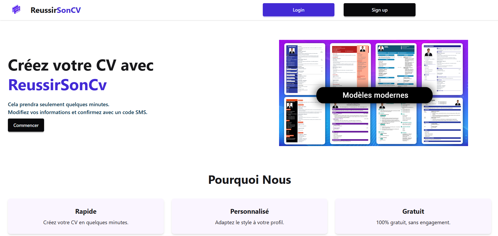

**Dashboard utilisateur**  
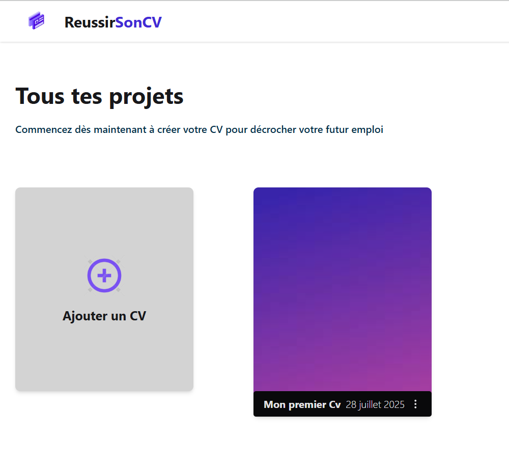

**CV rempli (exemple)**  
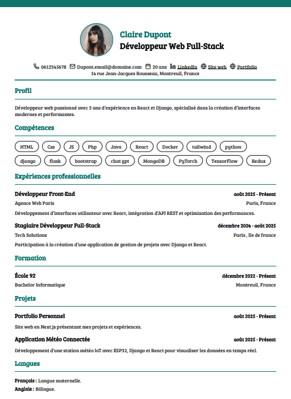

**Formulaire CV (expérience 1)**  
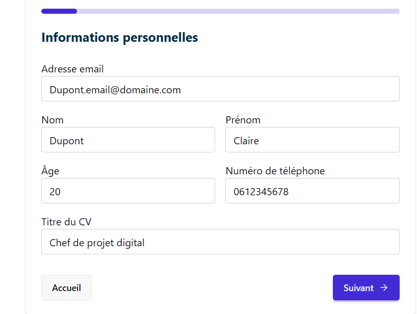

**Téléchargement du CV**  
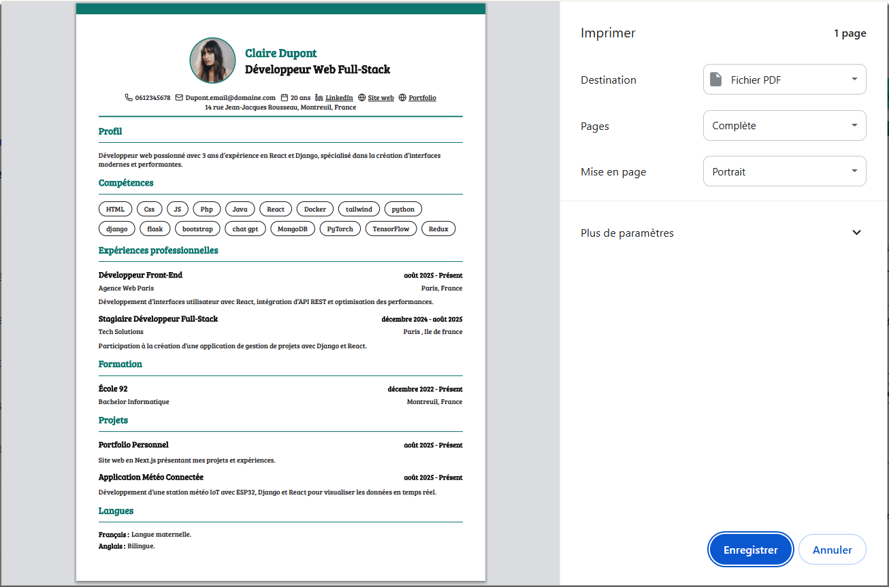

**Personnalisation des thèmes**  
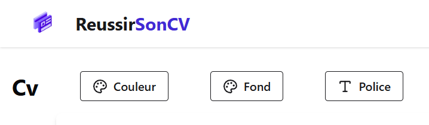

**Navigation profil**  
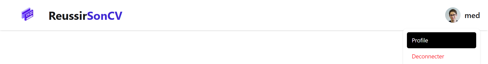

**Modification profil**  
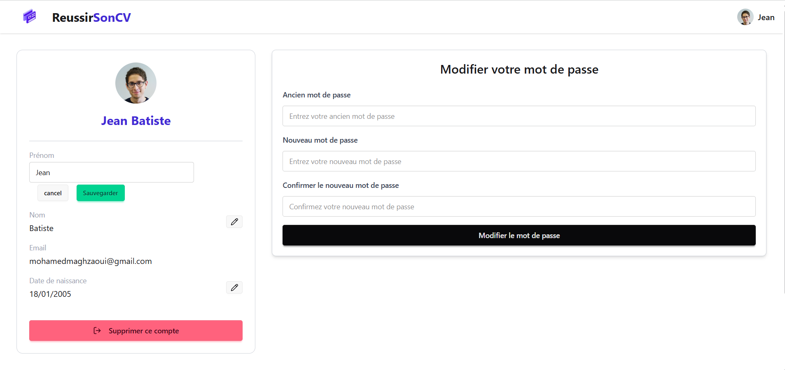

### Analyse IA & Limites
**Analyse IA du CV**  
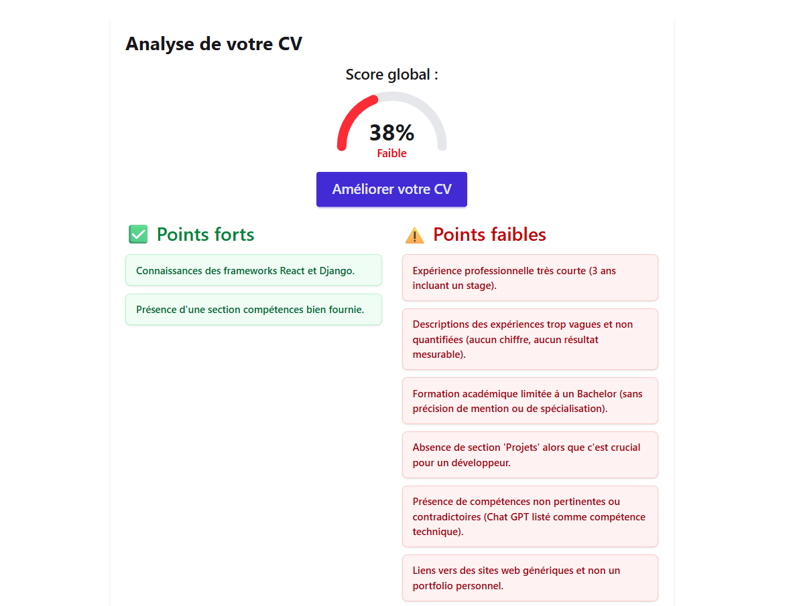

### Authentification
**Page de login**  
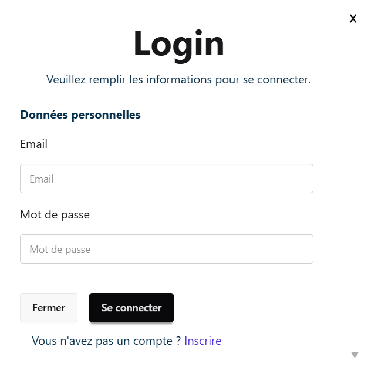

**Page d'inscription**  
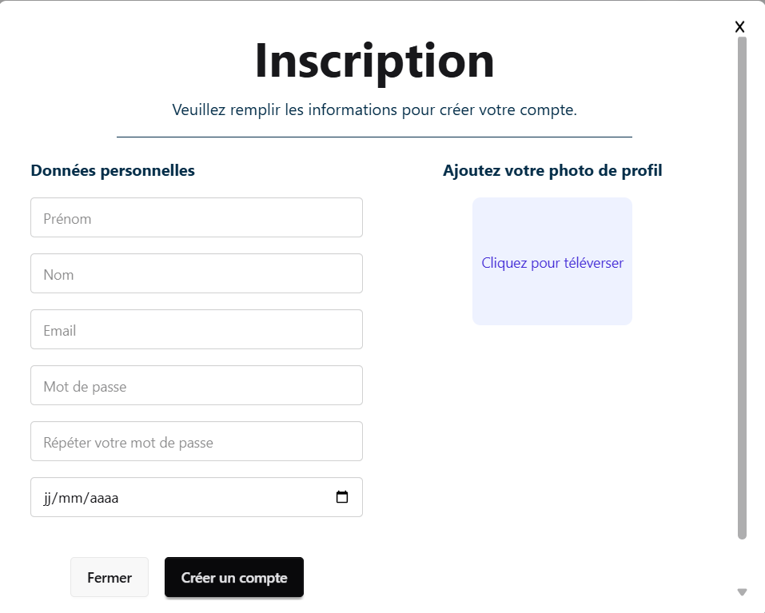

**Erreur login**  
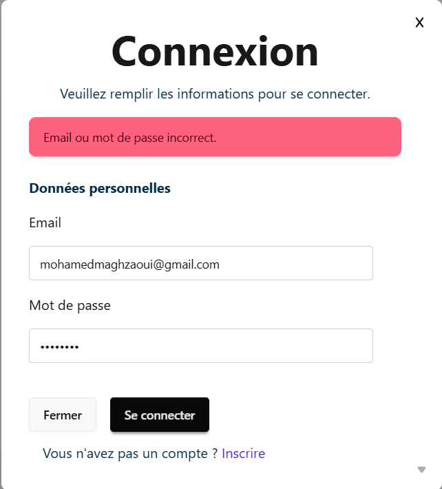

### Emails
**Vérification email**  
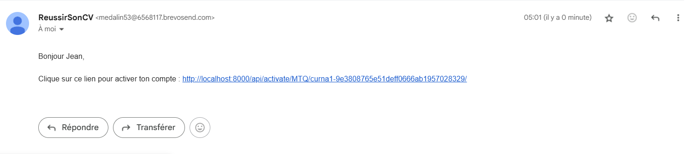

